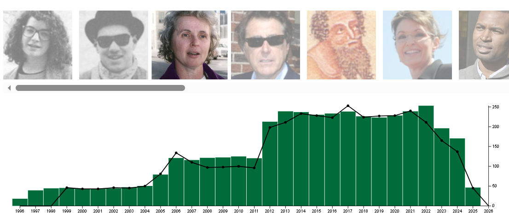

# Final Project Documentation/Projectbook

**Team Onion: Rachel Conca, Max McCalla, Elias Montas, Rohit Tallapragada**

## Meeting 1: 2/27/2026

- Rachel and Max met up in class to decide on project idea/start brainstorming ideas.
- Found various interesting datasets on *Data is Plural* before landing on the current dataset of fake quotes from The Onion on their "American Voices" series that we thought was interesting and entertaining.
- Talked with Prof. Harrison, and came up with an idea to plot how often The Onion uses each photo over time with a bar chart timeline of how many articles are published and have an interactive aspect where users could click the individual photos used by The Onion to see more details about what articles they were used in, what quotes the photo "said", and what their name/occupation was in each article.
- Set up a fork of the original repository on GitHub and added relevant folders for data/images and HTML and JS files for the actual coding of the visualization.

### Initial Sketch of Visualization

## Meeting 2: 3/3/2026

### Updates since previous meeting

- Max created JS file to link to the HTML file to start building our site.
- Max uploaded data from the CSV file and created a bar graph visualization that graphs total amount of quotes per year.
- Also created an interactive feature that changes the color of the bars when the user hovers over them.
- Rachel added an animation on load for the bar chart where the bars rise from 0 to their respective heights.

### Screenshot of updates

### During the meeting

- Worked on adding a scrollable div at the top of our site so that users can scroll through a list of photos to select the one they want to learn more about.
- Added a CSS file for standardized styling similar to The Onion's webpage (using their hex of green and white text).
- Running into issues with interactivity in the photo scroll div, working to debug and fix those over the next week.

### Screenshot of post-meeting site

## Meeting 3: 3/4/2026

- Elias worked on adding the line graph that tracks how frequently a selected image appears throughout the years. Selecting an image from the photo bar updates the line chart in real time in comparison to the bar chart.
- Elias attempted to fix issues with the photo scroll div interactivity, works on local computer currently.

### Screenshot of post-meeting site

## Meeting 4: 3/6/2026

### Updates since previous meeting

- Rachel edited line graph to be on a standardized y-axis for ease of comparison between different photo data. Also changed some stylistic things to make the points easier to read
- Rohit added tooltips to display relevant information about photos, bars, and points on the line graph.
- Max updated the photo tooltip to display statistics on which photos were commonly shown with other photos and highlighting the most commonly shown photos when tooling over a photo.
- Max changed the order of the photos so the most used photos load in first rather than loading all the photos by ID number.

### Screenshot of pre-meeting site

### During the meeting

- Rachel fixed photo transition on load in since it got messed up when changing the photo order.
- Max added feature that highlights the "in common" photos when tooling over a photo.